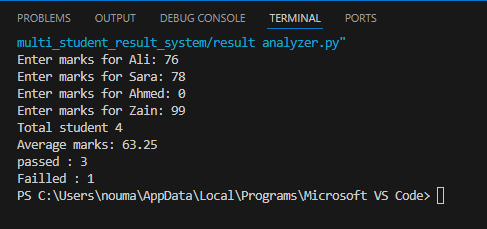

# 🎓 Student Result Analyzer

A beginner Python project that analyzes student marks, calculates average scores, and determines pass/fail status using functions, loops, and conditional logic.

---

## 🛠️ Features
- Handles multiple students using lists
- Takes marks as user input
- Calculates average marks
- Counts passed and failed students
- Displays student-wise results (Pass/Fail)

---

## 💡 What I Learned
- Creating and using functions
- Working with lists and loops
- Applying conditional logic (if-else)
- Structuring code into reusable parts
- Connecting multiple concepts to build a real program

---

## ▶️ How It Works
- Program stores student names in a list
- Takes marks input for each student using a loop
- Calculates:
  - Total students
  - Average marks
  - Number of passed and failed students
- Displays individual student results (Pass/Fail)

---

## 💻 Code Preview
You can view the full code in the `main.py` file in this repository.

## 📸 Sample Output

